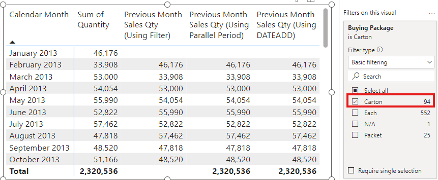

# Beginning-DAX-Seamark-Errata
Personal Errata for Phil Seamark's "Beginning DAX with Power BI" 1/e [book](https://doi.org/10.1007/978-1-4842-3477-8) published by Apress


## Chapter 5 (Joins)

### p. 98 - Table 5.2

| Make | Model | Year | Index |
| --- | --- | --- | --- |
| Toyota | Corolla | 2018 | 100 |
| Toyota | Corolla | ***2019*** | 200 |
| Hyundai | Elantra | ***2018*** | 300 |
| Hyundai | Elantra | 2019 | 400 |
| Ford | Focus | 2018 | 500 |
| Ford | Focus | 2019 | 600 |

## Chapter 6 (Filtering)

### p. 133 - Listing 6-1

*Should be >= 10, rather than > 10*
```dax
Count of Sales (10 or more) =
COUNTROWS (
    FILTER (
        'Fact Sale',
        'Face Sale'[Quantity] >= 10
    )
)
```

### p. 159 - Figure 6-19

Table should have a visual level filter of `'Dimension Stock Item'[Buying Package]="Carton"`.


## Chapter 9 (Practical Dax)

### pp. 252–257

Original DAX Table code is not very performant:
```dax
Top 10 Sales Products = 

VAR InnerGroup =
    SUMMARIZECOLUMNS(
        Sales[Product],
        Sales[Date],
        "Daily Revenue", SUM(Sales[Total])
    )

VAR CopyOfSummaryTable =
    SELECTCOLUMNS(
        InnerGroup,
        "ProductA", [Product],
        "DateA", [Date],
        "Daily RevenueA", [Daily Revenue],
        "RowCounter", 1
    )

VAR CrossJoinTables =
    FILTER(
        GENERATE( CopyOfSummaryTable, InnerGroup),
        [Product]=[ProductA] &&
        [Daily Revenue] <= [Daily RevenueA]
    )

VAR ProductByDateRanking =
    GROUPBY(
        CrossJoinTables,
        [Product],
        [Date],
        "Daily Revenue", MAXX( CURRENTGROUP(), [Daily Revenue]),
        "Rank", SUMX( CURRENTGROUP(), [RowCounter])
    )

VAR TopTenDaysPerProduct =
    FILTER(
        ProductByDateRanking,
        [Rank] <= 10
    )

RETURN 
   GROUPBY(
        TopTenDaysPerProduct, 
        [Product],
        "Average of Top 10 Best Days",
        AVERAGEX(
            CURRENTGROUP(), [Daily Revenue]
        )
    )
```

However, a **significant** speed improvement is obtained using this (simpler) code:

```dax
Avg top 10 sales =

VAR SalesByProduct =
    ALL (
        Sales[Date],
        Sales[Product]
    )

VAR ProductsSaleDays =
    ADDCOLUMNS (
        SalesByProduct,
        "Average sales for top 10 days",
            AVERAGEX (
                TOPN (
                    10,
                    VALUES ( Sales[Date] ),
                    [Sum of Total]
                ),
                [Sum of Total]
            )
    )

VAR SummarySales =
    SELECTCOLUMNS (
        ProductsSaleDays,
        "Product", [Product],
        "Avg Sales", [Average sales for top 10 days]
    )

RETURN
    TOPN (
        10,
        DISTINCT ( SummarySales ),
        [Avg Sales]
    )
```

Where the measure `[Sum of Total]` is defined as `Sum of Total := SUM(Sales[Total]`

It should be noted that the original DAX code is quite an interesting way to approach the problem!
